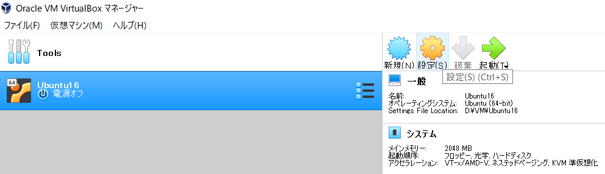
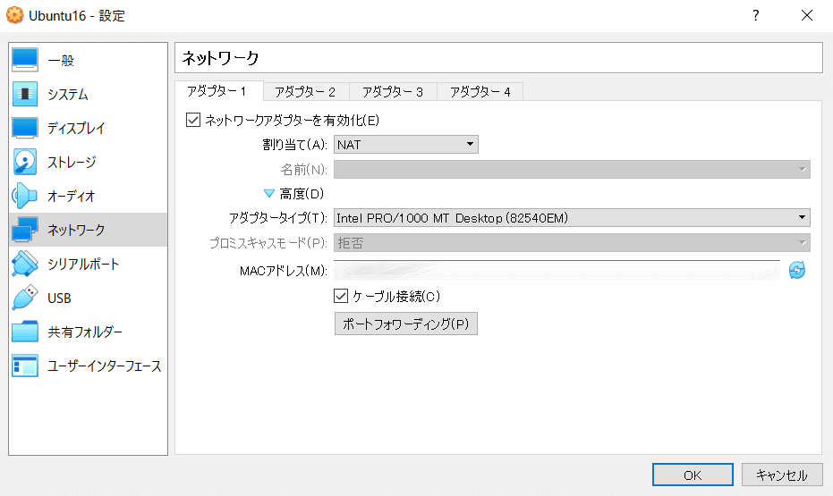
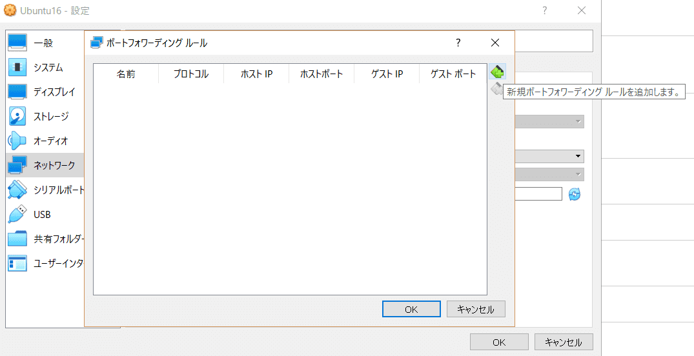
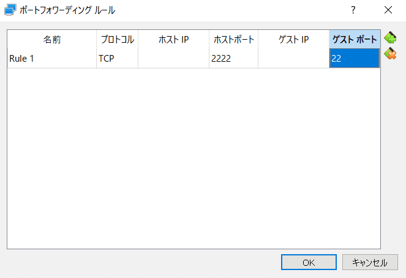

先日、友人と CTF (Capture The Flag) に参加しました。

CTFというのは、原義はそのまま「旗取り合戦」で、野外ゲーム・スポーツや、FPSの陣取り合戦などを指すようです。

私が参加したのはこういったアクティブなものではなく、コンピュータやネットワークの知識を使って、サーバーやファイルなどから Flag代わりの文字列を見つけ出す、という、セキュリティ競技と呼ばれるものです。  
Flagを見つけ出す方法として、例えば Webページの脆弱性を突いたり、ファイルにかけられた暗号を解読したりと、セキュリティ関係の知識が必要となるので、こうした勉強・腕試しにもってこいなものなのです (でもとても難しい......)。

今回 CTFに挑戦するにあたって、Linux環境を用意する必要が出てきました。厳密にいうと必須ではないのですが、Linuxで使えるコマンドなどが CTFではとても強力な武器となるので、わたしの使っている Windowsからアクセスできる Linux環境が欲しかったのです。  
そこで、Oracle VM VirtualBoxでさくっと簡易な環境を用意し、ポートフォワーディングを使ってホストマシンから sshできるようにしました。

設定に少し手間取ったので、備忘も兼ねて。  
なお、本記事では、ポートフォワーディングとは何か、なぜそれで host -> VMの通信が実現できるか、の解説も書きました。

## はじめに: CTFを知る

余談。CTF初耳、という方や、名前は知ってるけど挑戦したことない、という方は、ぜひ以下の参考資料を。

まず、雰囲気を知りたい方は、小説投稿サイト「カクヨム」に投稿されている、鶴見トイさんの『ハッカーとチョコレート』という作品がとてもおすすめです。

(川合史郎さんのツイートで知りました)

<blockquote class="twitter-tweet"><p lang="ja" dir="ltr">すっごく面白かった。技術解説とストーリーのバランスが、知ってる人が読んでも知らない人が読んでも楽しめる絶妙なところをついてる感じがするのだけれど、どうだろう?<a href="https://t.co/IbsHuQ0TuB">https://t.co/IbsHuQ0TuB</a></p>&mdash; Shiro Kawai (@anohana) <a href="https://x.com/anohana/status/1051077828022697985?ref_src=twsrc%5Etfw">October 13, 2018</a></blockquote> <script async src="https://platform.x.com/widgets.js" charset="utf-8"></script>

また、[ksnctf](http://ksnctf.sweetduet.info/) という、いつでも挑戦できる CTF問題集のようなサイトも存在しますので、そちらを見てみるのもよいと思います (多分初めての人は、問題のヒントの少なさに驚くと思います)。

**※なお、CTFで利用する、脆弱性を突くなどしたデータ取得・解析・改竄のための各種ツールや手法などは CTFだから許されているのであり、通常のシステムに対して利用するのは法で罰せられるレベルなのでくれぐれもご注意ください。最近話題ですね……**

## VirtualBoxで Linuxゲストを作る

では本題です。まず、何はともあれ Windows上に Linuxの仮想マシンを作ります。  
わたしは CTF用の一時環境が欲しかったので、ペネトレーションテスト[^1]用のツールが初めから揃っている Kali Linuxで環境構築しましたが、普段使いに使うものではないので、ここでは安定の Ubuntuを利用して説明します。

### 1. exeファイルをダウンロード

以下、ホストマシンの OSは Windowsの前提で書きます。

インストール方法の解説は割愛します、インストーラーは[公式サイト](https://www.virtualbox.org/wiki/Downloads) から取得できます。  
わたしは 2019/3/9現在バージョン 6.0.4 r128413 (Qt5.6.2) のものを利用しています。

### 2. Ubuntuの isoイメージファイルの取得

Ubuntuの isoイメージは公式サイトなどから取得できます、サポート期限内かつ LTS[^2]のものが安心です。  
[Index of /releases](http://old-releases.ubuntu.com/releases/)

今回は、ubuntu-16.04.5-server-amd64.isoを選択しました。

### 3. 仮想環境への Ubuntuのインストール

手順一つ一つをキャプチャ取って進めてたら、35枚になりました、多い。  
本題から外れるので、この辺の手順は気が向けば別記事にまとめようと思います。

ちなみに言語は Englishがお勧めです。  
全角のフォルダは不安定な動作を引き起こす可能性があり、Englishでもそんなに難しい英語は使われないので。

### 4. ホストからゲスト VMに sshするための設定: ポートフォワーディング

仮想環境ができたのですが、コンソールは狭く、フォントも見づらく、マウスはキャプチャされるなど、使い勝手は今一つです。  
そこで、PuTTY, Tera Term, MobaXtermなどの仮想ターミナルソフトウェアを使ってホストから sshして利用します[^3]。  
こうすることで、画面もフルに使えるし、フォントなどもターミナルエミュレータ側で一括して設定できるので便利です。

それと、今回は Ubuntu serverで構築したので軽いのですが、GUIがある OSで構築すると動作が重くなりがちです (代わりに画面サイズやフォントの問題はデフォでクリアしてくれますが)。  
sshなら、描画が必要ないのでそうした重さもある程度軽減できます。

---

では、次から実際の設定を説明していきます。

sshするために、ここでは **ポートフォワーディング** という仕組みを利用します。

#### まずは sshを試してみる

小難しい用語が出てきたけど、そんなもの使わなくても ifconfigコマンドなどで仮想環境の IPアドレス調べて、それに sshすればいいのでは？

......sshを叩いてみます。デフォルトのままの設定なら失敗します。

まず、仮想環境にそもそも openssh-serverがインストールされていない場合があります。これがないと sshを受け付けられません。

```bash
sudo apt-get install openssh-server
```

これでよし、再起動して sshすると、やはりだめです。  
やはり追加で何らかの設定が必要そうです。

#### なぜ sshできなかったか

##### NATモード利用時の VMのネットワーク構成

自分のローカルマシンに構築した VMなので、ネットワーク的には問題なさそうに思えます。  
ところが、デフォルトのネットワーク設定である NATモードで作成される VMは、 **それぞれ独立したプライベートネットワークに属するもの**  となります。

VirtualBoxのマニュアルには、NATモード時の VMの振る舞いについて、以下のように書かれています。

> A virtual machine with NAT enabled acts much like a real computer that connects to the Internet through a router. The router, in this case, is the Oracle VM VirtualBox networking engine, which maps traffic from and to the virtual machine transparently. In Oracle VM VirtualBox this router is placed between each virtual machine and the host. This separation maximizes security since by default virtual machines cannot talk to each other.

*cf*. https://www.virtualbox.org/manual/ch06.html 6.3. Network Address Translation (NAT)

すなわち、NATモードでの VMは、ルータ経由 (VirtualBoxでは Oracle VM VirtualBox networking engineが仮想ルータのようなもの) でインターネットに接続されているマシンのようなものであり、このため外のネットワーク、つまり hostやインターネットから遮蔽されている、ということとなります。

簡易な図で示すと以下のようになります。

```text
NATモードでの VMの状態
- VMは VMごとに存在する仮想ルータ (networking engine) 経由で hostと通信
- このため VMはそれぞれ閉じた Private Networkに遮蔽されており VM間通信不可

┌------------------------┐
|          HOST          |
|                        |
| ┌--|------|------|---┐ |
| |  |      |      |   | |
| | (NE)   (NE)   (NE) | |
| |  |      |      |   | |
| | [VM]   [VM]   [VM] | |
| |                    | |
| |     VirtualBox     | |
| └--------------------┘ |
└------------------------┘
```

ということで、同じ LANではなく、異なる LANのプライベートアドレスに対して sshを行ったので、解決できずにエラーとなった、ということとなります。

##### グローバルIPは？

じゃあ、VMのグローバルIPを調べて、それに sshすればいいじゃん！　となるのが自然です。
VMに friefoxをインストールして、グローバルIPを調べてみましょう。  
グローバルIPは、https://www.cman.jp/network/support/go_access.cgi などで調べられます。

結果、確かにグローバルIPが表示されます。  
されますが、実はこれは、hostマシンのグローバルIPと同じものです。

......NATモードでは上の図の通り、hostマシンを介して外の世界と通信しています。
このため、hostマシンを含め、グローバルな外の世界からは、VM発の通信も hostマシンそのものから出ているように見えるのです。  
マニュアルにある通り、NATモードでは、VirtualBoxは hostに届いたパケットをリッスンし、自分が送ったものへの返信だけを VMに再送しているのです。

> The disadvantage of NAT mode is that, much like a private network behind a router, the virtual machine is invisible and unreachable from the outside internet.
>
> ...
>
> To an application on the host, or to another computer on the same network as the host, it looks like the data was sent by the Oracle VM VirtualBox application on the host, using an IP address belonging to the host. Oracle VM VirtualBox listens for replies to the packages sent, and repacks and resends them to the guest machine on its private network.

*cf*. https://www.virtualbox.org/manual/ch06.html 6.3. Network Address Translation (NAT)

#### ポートフォワーディングを用いる

これでは、hostから VMへの通信ができません。  
したがって、sshもできません。今回行いたい sshは、host発、つまり VM外発の通信だからです。

ここで、NATモードでも外部からの通信を可能にするのが、冒頭紹介した **ポートフォワーディング** です。

##### ポートフォワーディングとは

まず大事な前提として、これは **ルータに施す設定** です。  
VirtualBoxを操作していると、何でもかんでも VM自体に設定しているように感じてしまいますが、ポートフォワーディングはルータ、すなわち VirtualBoxでは network engine (仮想ルータ) に対して設定するものです。

では、ポートフォワーディングとは何か。  
これは、 **指定したポートへの通信が届いたら、それを別のポートに転送**  する仕組みです。

今回目的とする sshを取り上げて、具体例を考えてみましょう。

VirtualBox NATモードでは、すでに書いた通り、VMが属するプライベートネットワークが外部から見えないことが、sshなどの通信を不可能にしていました。  
VMが hostを介して通信しているので、外部から見ると VM発の通信も hostから発信したように見えていたのでした[^4]。

しかし、逆に言えば、VMのネットワーク機構からは、hostに届く通信は見えています (VM発のインターネットなどへのリクエストに対するレスポンスは hostに返り、それを待ち受けていた VirtualBoxがちゃんと発信者の VMに転送していました)。

この仕組みを利用して、 **hostの特定ポートに届いた通信を、guestの特定ポートに転送する**  という設定を施してやれば、sshをはじめとする外部からの通信が実現できます。

すなわち、ここでは sshしたい VMの仮想ルータに、 **hostの 2222番ポートに届いた通信を guest VMの 22番ポートに転送する** という設定をしてやればよいです[^5]。

その上で、hostでは自分自身の 2222番ポートに対して sshを実行してやります。  
localhostでも host名でもループバックアドレスでも、host自身にリクエストを送っていればよいです。

```bash
ssh -p 2222 ${USER}@127.0.0.1
```

こうすると、VirtualBox側でホストの 2222番ポートに来た sshをキャッチし、これをそのまま guest VMの 22番ポートに転送して、めでたく NATモードでも guest VMへの sshが実現できます。

#### ポートフォワーディング設定手順

それでは、実際の設定手順を説明します。

まず、ネットワークの設定をするために一度 VMの電源をシャットダウンしておきます。  
電源をシャットダウンしたら、VirtualBoxの管理画面から該当の VMを選択して、設定ボタンを押します。


設定ボタンを押すと下の画像のような画面が表示されるので、「ネットワーク」を選択後、「高度」の部分をクリックして展開し、ポート[フォワーディング] をクリックします。


ポート[フォワーディング　ルール] が出てくるので、右上の [プラス] ボタンを押して、ルールを追加します。


[ホストポート] には hostに届く、転送対象の通信のポート番号を、[ゲストポート] には guest VMのどのポートにその通信を転送するかを入力します。
[ホストIP]、[ゲストIP] は空で構いません。
[ホストIP] が空なら、ホストの 2222番ポートに届いた全ての通信を転送してくれます。
[ゲストIP] も、何らかの理由で guest VMの IPを静的なものに固定していなければこのままで大丈夫です。


これで、VM側で sshを受け付ける準備が整いました。  
先ほど停止した VMを起動して[^6]、hostのターミナルから sshしてみましょう。  
コマンドはすでに紹介した通りで、自分自身に対してポート指定で sshしましょう。`${USER}`には、VMのユーザー名を入れます。

もしうまくいかなかったら、

- VMは起動しているか
- openssh-serverが VMにインストールされているか
- openssh-serverが VMで起動しているか
- openssh-serverの VM上のポート
- ポートフォワーディングの設定は正しいか
- sshコマンドの使い方は正しいか

などを確かめてみてください。  
これで、CTFをはじめ様々な目的のために快適に Linux仮想環境を触る準備ができました。

### 5. おまけ

今回は NATモードでポートフォワーディングを使う方法を紹介しましたが、他にも host -> guest通信を実現する方法はあります[^7]。

公式マニュアルの "6.2. Introduction to Networking Modes" にある "Table 6.1. Overview of Networking Modes" では、VirtualBoxで利用できる 5種のネットワークモードそれぞれの特徴を一覧表にまとめてくれています。  
そこにある通り、VM `<-` Hostの通信を実現する手段は、Internal Network以外の 4種でも実現できます。

*cf*. https://www.virtualbox.org/manual/ch06.html#networkingmodes

とはいえそれぞれ向き・不向きや、特にセキュリティ関係と簡便さのトレードオフというか、良し悪しがあるので、そのあたり比較してみるとおもしろそうですね。

いろいろ調べてわからなかったことがマニュアルにはしっかり書かれていて、困ったら公式マニュアルを見るのが大正義、と今回改めて思いました。

[セキュリティコンテストチャレンジブック -CTFで学ぼう! 情報を守るための戦い方-](https://book.mynavi.jp/ec/products/detail/id=42421)

[ネットワークはなぜつながるのか 第2版 知っておきたいTCP/IP、LAN、光ファイバの基礎知識](https://bookplus.nikkei.com/atcl/catalog/07/P83110/)

[新しいLinuxの教科書](https://www.sbcr.jp/product/4815624316/)

[^1]: 脆弱性 診断のために別のマシンに侵入を試みるテスト
[^2]: LTS: Long Term Support, 長期サポート版のこと
[^3]: わたしは今は MobaXtermを使ってます、 FTP もこれ一つでできるし高機能な GUI も備えていてとても便利。MobaXtermについては、 こちらの記事 が参考になります
[^4]: ちなみに VM 発の通信へのレスポンスがちゃんと VM に返ってくるのは、送信パケットに発信元の情報があるからですね。はがきを送るときに、自分の住所を書くようなものです
[^5]: ssh の well known portは 22なので、22番ポートに転送します。設定で ssh のポートを変えていたら、22番でなくそのポートに転送してあげる必要があります。host側の 2222は監視対象の仮ポートでしかないので、他のアプリなどと被らない番号であれば何でも構いません
[^6]: ssh で使う前提なら、画面が表示されなくて軽い [ヘッドレス起動] がよいです
[^7]: VirtualBox のポート フォワ ーディングで検索すると、「こう設定します」のみで完結している記事が多くて、どうしてそれでいいのか、そうなるのか知りたくていつももやもやしてたので、個人的に本記事作成は良い機会でした
