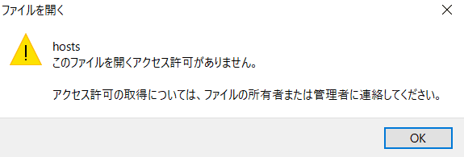
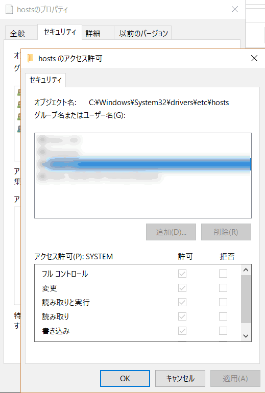
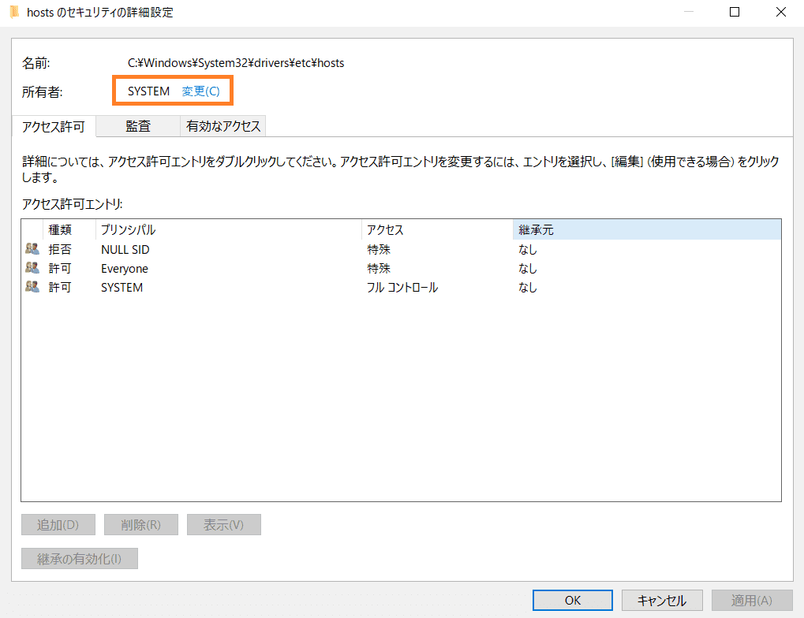

## TL;DR

- (今回の) 原因はアクセス権だった
  - hosts ファイルの**所有者**を変更し権限の編集を可能にする
  - hosts ファイル**編集**のために**操作ユーザーの読み書き権限**追加が必要
  - hosts ファイル**参照**のために**ユーザーグループの読み取り権限**追加が必要
- **セキュリティ対策**で最後に hosts ファイルの書き込み権限・所有者を戻して終わり

## 1. 背景：徳丸本の環境準備で詰まる

　先日友人と Web アプリケーションを作ってみよう, という話になり, このため本棚の肥やしになっていた『体系的に学ぶ 安全なWebアプリケーションの作り方』(通称「徳丸本」) をついに開きました。  
この本は国内の Web アプリケーション開発者や QA にとってバイブル的な立ち位置にあり, 目にしたことがある方も多いのではと思います。

[体系的に学ぶ 安全なWebアプリケーションの作り方 第2版 脆弱性が生まれる原理と対策の実践](https://www.sbcr.jp/product/4797393163/)

　この本の第2章に「実習環境のセットアップ」という章があり, 著者が用意してくれた仮想環境 (VirtualBox のアプライアンス) をダウンロードして少し準備するだけで, ハンズオン形式で本の内容を学習することができます。  
実際に手を動かして学べるのはとてもありがたいですね。

　ところが, わたしはこの環境のセットアップステップの 1つ, 「仮想環境上で動く Web ページの URL と IP アドレスを hosts ファイル[^1] に書き込む」という箇所で詰まってしまいました。いろいろと調べましたが今回の原因にピタリ当てはまるものは見当たらなかったので, 記録のために残しておきます。

## 2. 何が起きたか

### hosts が管理者ユーザーでも開けない

　まず, これまで業務などでも経験があるように, かつ徳丸本にも書いてあるように, hosts ファイルを編集するためにテキストエディタを「管理者として実行」しました。hosts ファイルなど一部重要なファイルはアクセス制限がされており, これをしないと開く = 読むことすらできないためです。一応 IT 企業勤務数年やぞ, サクッと終わらす, という気持ちで進めていたら

え, 管理者なんだけどな......  
念のため, 操作中のユーザーが管理者権限を持っていることを確認しました。

何でもできると思っていた管理者であるにもかかわらず, アクセスを拒否されている。  
エディタを変えたり, コマンドプロンプトを管理者として実行し, そこで notepad を使ってコマンドで開いたりと, いろいろ試しましたが結果は同じでした。

じゃあファイル自体のアクセス権限を操作しようと, hosts ファイルを右クリックして操作中のユーザーに読み書き権限を与えようと思ったら, それすらできません。

Web を検索してもピタッとくる情報はなく, 原因解明は諦め一旦 MobaXterm で `sudo vim hosts` をしたところ無事開けたので, 編集して保存しました。

### hosts の内容が反映されない

　無事 hosts を編集できたので, その結果を確認するべく, hosts に新たに書き加えたドメイン名 `example.jp` に対して ping を飛ばしてみました。  
内容が反映されていれば, hosts を参照して名前解決され, ping の応答があるはずです。

......しかし, 結果は返ってきません。  
そうだ, リゾルバのキャッシュをクリアしていないからか, と思い立ち, `ipconfig /flushdns` を実行しました[^2]。  
しかし, それでもやはり ping は通りません。

## 3. ファイルの所有者を変更して編集可能にはできた

　vim で編集はできましたが, 結果は反映されていません。  
後述しますが文字コードや改行コードなども確認したかったため, また本来 MobaXterm や Cygwin などの sudo コマンドを使わずとも Windows の機能だけで編集できるはずなので, さらに原因を調べました。  
いろいろ調べると, どうやら**アクセス権限の編集ができないのはファイルの所有者が異なるから**のようでした。  
管理者でも操作できないのか......と少し釈然としない思いで, hosts を右クリックして「セキュリティ」タブから「詳細設定」をクリックし, **所有者を操作中のユーザーに変更**しました[^3]。

すると, ファイルのアクセス権限を自由にいじることができるようになりました。  
操作中ユーザーに読み書き権限を与え, これでようやく普通にテキストエディタで参照・編集できるようになりました。  
しかし, ping の結果は相変わらず通らないままです。

## 4. 試したこと

　解決に至るまで, わたしが確かめたこと, 試して効果がなかったことを列挙しておきます。

1. **IP アドレスに対し ping が通ることを確認**
   - 名前解決以前に, そもそも目的のサーバーと疎通できるかを, IP に対して ping を送って確認しました。  
     宛先であるサーバー (今回で言うと VM) の設定ミスや, サーバーが起動していなかったりするとそれ以前の問題だからです。  
     結果, そんなポカはしておらず, ちゃんと ping は返ってきました。
2. **拡張子やファイル名が正しいか確認**
   - 編集などした過程で hosts に変な拡張子の付加や名前, 場所の変更などがあれば, 当然参照されません。  
     しかしこちらも問題ありませんでした。
3. **テキストエディタを「管理者で開く」**
   - 開けませんでしたが, 操作中ユーザーに権限を与えることで開けるようになりました。しかしそれで書き換えても内容の反映がされていません。
4. **DNS キャッシュクリア**
   - 前述の通り効果はありません
5. **操作中ユーザーのアクセス権限の確認**
   - 前述の通り効果はありません
6. **改行コード**
   - 前職で何度かはまったのですが, Linux と Windows では改行コードが異なります[^4]。  
     今回 hosts ファイルを編集する際, MobaXterm から vim で編集したので改行コードが混在していて, うまく読まれていないかもしれないと疑いました。  
     普段使いの Atom で開いてみましたが, CRLF になっていました。
7. **文字コード**
   - Web を調べていたら, Windows の hosts の文字コードは ANSI (cp932[^5] ) でないといけないらしい, とありました。  
     同じく vim 編集の副作用を疑い, 確認したら UTF-8 にしていたようだったので直してみました。  
     ですが結果は変わりませんでした。
8. **OS 再起動**
   - 困ったときの再起動もダメでした

## 5. まとめ：解決策はユーザーグループの読み取り権限追加

　Web で調べられる情報はあらかた試し, それでもだめで万策尽きたかに思えました。  
原点に立ち返り, 権限がおかしいのだろうというところから出発し, 同フォルダ内 = アクセス権などが同等のはずの他のファイルとアクセス権限を見比べてみました。  
すると, hosts になくてそれらファイルにあった特異なものとして, **Users グループの読み取り・実行権限が付与されていること**がありました。

　なぜかはわからないが, 例えばコマンド実行時は操作中ユーザーでなく一般的な権限などが適用されるのかな？　ユーザーではなくグループの権限が必要だったか, と思い, hosts にも Users グループの読み取り権限を付与し, キャッシュクリアをしてみました。  
すると, ようやく無事 ping が通りました！

以上より, 今回の解決策をまとめると次の通りとなります。

1. **hosts ファイルを編集できない場合, 所有者を操作中ユーザーにしてアクセス権限の編集を可能にする**
2. **アクセス権限を編集し, 操作中ユーザーに読み書きの権限を付与する**
3. **アクセス権限を編集し, Users グループに読み取り権限を付与する**

## 6. 注意点：hosts ファイルがアクセス制限されている理由と後片付け

　以上で hosts ファイルを編集・参照できない問題については解決となります。  
しかし, そもそもなぜ hosts ファイルがこんなややこしい設定になっていたのかにはちゃんと理由があります。  
**その注意点を把握しないまま編集しっ放しにするとセキュリティリスクとなる**ため, ここに注意点も記しておきます。

hosts ファイルの機能は, すでに書いた通り名前解決を行う, というものです。  
つまり何らかの理由で hosts ファイルが外部から書き込み可能になるなどし, **知らない間にこのファイルによく使うサイトのホスト名に, 本物そっくりに作られたフィッシングサイトの IP アドレスを書き込まれると, 気づかずに重要な情報を漏洩してしまう**ことがあり得ます。  
例えば Amazon のホスト名に対し, Amazon を騙ったフィッシングサイトの IP アドレスが紐づけられると, それと気づかずにクレジットカード番号や住所など, 重要な個人情報を自身で漏洩してしまうでしょう。

こんな悪意ある攻撃から守るために, 多くのセキュリティ対策ソフトでは hosts への書き込みを禁止したり監視したりしています。

ですので, 今回 hosts のアクセス権限をいろいろいじりましたが, 最終的には**所有者を戻しておく, 不要なアクセス権があれば外しておく**などして, なるべく元の状態に近づけておきましょう。  
読み取りができれば hosts の参照はできるので, Users グループの権限はそれだけにしておけばそれほど脅威はないでしょう。  
また, 所有者も元のもの (わたしの場合は SYSTEM) に戻しておけば, 何らかの手段でアクセス権限を書き換えられるリスクも減るでしょう。

以上, リスクも理解した上で適切にアクセス権も管理し, 徳丸本の演習を一緒に始めましょう！[^6]

[^1]: hosts ファイルは, Windows なら "C:\Windows\System32\drivers\etc\hosts" にあります。名前解決の際, DNS サーバーに問い合わせる前に参照される, IP アドレスとホスト名の対応を記述したファイルです。
[^2]: 名前解決の度にファイル参照や DNS サーバーへの問い合わせを行うと遅延が発生するため, メモリに名前解決の結果がキャッシュされています。Windows ではこのコマンドでキャッシュクリアができます。前職で経験しましたが, サーバーリプレースなどの際に特に注意が必要です。
[^3]: これができるのは管理者だからなのでしょう
[^4]: Windows では CRLF, Linux 系では LF です。Windows で設定ファイルなどを編集して Linux に転送, などするとこのせいでエラーが起きたりします。余談ですが Github はリポジトリの clone 時などにこの辺いい感じに調整してくれます。
[^5]: Windows-31J とか 拡張 Shift_JIS とも呼ばれるやつです。
[^6]: もちろん徳丸本の演習だけに必要な知識ではない
