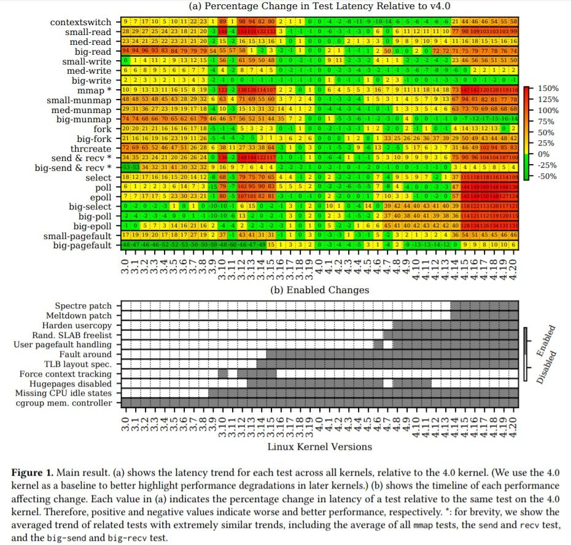
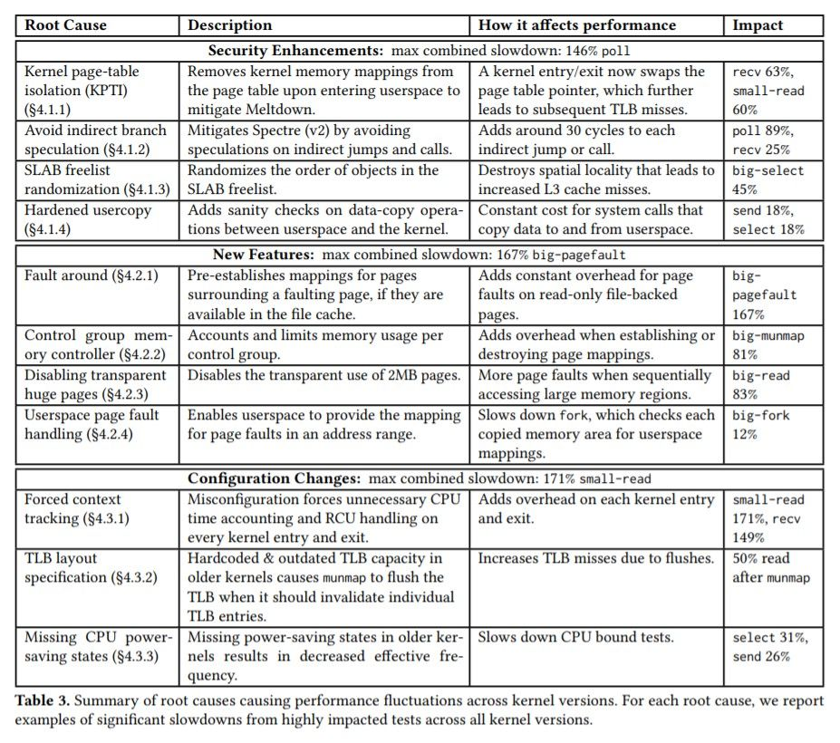

大学院で一緒だった友人と CS 系の論文も読んでみよう, という話になり, 大体 4年振りに論文を読みました。  
気になる論文を探すのも一苦労だったのですが, 今回は "An Analysis of Performance Evolution of Linux Core Operations" (Ren, X., Rodrigues, K., Chen, L., Vega, C., Stumm, M., and Yuan, D., 2019) です[^1]。

さすがに理解できていない部分もあるのですが, 気になった点をまとめておきます。  
読み違えている部分もあると思うので, お気づきの際はご指摘いただけると助かります。

## 概要

- 論文概要
  - SOSP (Symposium on Operating Systems Principles) 2019 Oct. 29 で発表されたらしい
  - 著者は Tronto 大学の学生と教授か
  - 過去 7年間の間に出たバージョンごとの Linux のパフォーマンス分析
  - 計測には自身らで用意した LEBench という benchmark ツールを使っていて GitHub にも上がっている[^2]
    - https://github.com/LinuxPerfStudy/LEBench
- Linux kernel について
  - 最初のバージョンが出た年と現在のバージョン
    - 1991 年に 0.01, 2020年1月時点で 5.4.14
  - 論文で取り上げているバージョンは 3.0 から 4.20
    - Ubuntu との対応は https://en.wikipedia.org/wiki/Ubuntu_version_history#Table_of_versions
      - 16.04 LTS は 4.4, 18.04 LTS は 4.15

## 測定

- kernel version: 3.0 から 4.20
  - マイナーバージョンは backport の影響を避けるため次のメジャーバージョンが出る直前の最新版
- distribution: Ubuntu
- ハードウェア構成[^3]
  - HP DL160 G9
  - 2.40GHz Intel Xeon E5-2630 v3 processor
    - 512KB L1 cache
    - 2MB L2 cache
    - 20MB L3 cache
  - 128GB of 1866MHz DDR4 memory
  - 960GB SSD
- 測定対象: contextswitch と 23 (+ α) の systemcall[^4]
  - contextswitch
  - small-read
  - med-read
  - big-read
  - small-write
  - med-write
  - big-write
  - mmap
  - small-munmap
  - med-munmap
  - big-munmap
  - fork
  - big-fork
  - thrcreate
  - send & recv
  - big-send & recv
  - select
  - poll
  - epoll
  - big-select
  - big-poll
  - big-epoll
  - small-pagefault
  - big-pagefault
- サンプリング: 全ての測定を 10,000 回繰り返し, k=5, tolerance 95% の k-best method を利用[^5]

## 結果

Figure 1 に測定の結果がまとめられています。  
ここではバージョン 4.0 を基準 (0) として, 4.0 と比べた際のパフォーマンス変化を示しています。

一見して, 4.14 あたりから大きくパフォーマンスが下がっていることがわかります。  
Figure 1 の下の図を見ると分かるのですが, この頃世をにぎわせた Spectre, Meltdown のパッチが提供されています。

実は著者らが調べた範囲では, これらのパッチが今回の測定におけるパフォーマンス低下の大部分を占める, とありました[^6]。  
残念ながら, セキュリティ対策は避けられないものでありながら, 大きくパフォーマンスに影響することが多いもののようです。

### パフォーマンス低下の主要因

著者らは, 計測結果に基づき, 今回の測定範囲におけるパフォーマンス低下の主要因を, 3カテゴリ, 11項目に分類しています。  
これは Table 3 にまとめられていますが, 以下の通りです。

1. security enhancement
   - kernel page-table isolation (Meltdown) ※1
   - avoid indirect branch speculation (Spectre v2) ※2
   - SLAB freelist randomization
   - Hardened usercopy
2. 新機能 (コンテナや仮想化のサポートなど)
   - fault around
   - cgroup memory controller ※1
   - userspace transparent huge pages
   - userspace page fault handling
3. ミスを含む初期設定
   - forced context switch ※1 ※2
   - TLB layout specification
   - missing CPU power-saving states ※2

※1 現時点では最適化・無効化されている  
※2 今回の測定でのパフォーマンス低下の 88% を占める

1 に関してはすでに述べた通り, セキュリティ関係なので, 目をつぶらざるを得ない部分があります。  
しかし Retpoline[^7] のように, 後にパフォーマンス影響を抑えたパッチが出ることもあります。

2 は機能強化とのトレードオフで, これら機能を利用するならば仕方のないものです。  
新機能はそれだけで十分嬉しいものなので, あきらめがつく部分でもあるのかもしれません。  
また, 考察部で著者らも述べているように, 実際の利用状況に合わせて適切に設定・無効化すれば良い部分はありそうです。

3 は単なるミスなので, 現在稼働中のサーバでこれらが意図せず設定されていないか確認すればよいです。  
大抵はすでにデフォルト設定が修正されており, backport[^8] などもされているでしょう。

## 所感

　以下所感です。

- セキュリティ対策によるパフォーマンス影響は大きい
  - かといって著者らがパフォーマンス低下を避けるために, 論文中で紹介している独自開発したパッチを当てるのは, 妥当性が担保されない限り避けたい気持ちがある

ここはトレードオフなのでどうしようもないのでしょう。  
今後もセキュリティ対策で数十% レベルのパフォーマンス低下が起きることは覚悟しておいた方がよさそうです。  
それを見越して, 常日頃からパフォーマンスチューニングに気を配っておくことは大事ですね。。

- misconfiguration も今回はパフォーマンス低下の大きな割合を占めていた
  - これはすぐ直せる, ただし現実にはすでにデフォルトで直されていることが多いでしょう
  - 念のため確認してみて, 設定がされていたらラッキー

これはちょっとずるいところで, 論文中では「これら設定を見直すことでパフォーマンスを向上させられた」との主張につなげていますが, 大体現行の最新マイナーバージョンなら直されていると思われます。  
しかしもしも, 本番稼働しているサーバなどでこうした設定が有効化されていたなら, タナボタ的に結構なパフォーマンス増は望めそうですね。  
しかし初めからこうした設定はないほうがよいので, 設定のチェックリストなりは用意してあって確認した方がよさそうです (詳解システム・パフォーマンスにもこんなことが書いてあった)。

- workload に合わせて設定を変えたり機能無効化したり, チューニングしましょう

著者らも述べていましたが, Linux は汎用的な kernel 設定で世に出されています。  
しかし現実には特化した用途のサーバもあるわけなので, デフォルトのまま使わないで用途に合わせたチューニング, 設定をするのがよさそうです。  
といっても, この辺りはもちろん本稼働しているものではほとんどやっているとは思いますが, 意外に「この辺までは見ていなかった」「当然こうなっていると思ったけど実はなっていなかった」なんてこともあるので, 見ておくに越したことはないと思います。

以上, CS 系の論文を読むのは初でしたが, 新鮮でおもしろかったです。  
ただ前提知識の不足は感じたので, その辺は引き続きキャッチアップに努めようと思います。  
次は RFC も読んでみようかなと思いますが, 機会があればまた記事にまとめてみます。

[^1]: https://dl.acm.org/doi/10.1145/3341301.3359640
[^2]: ただし 2020/1/26 現在で watch 5, star 17 なのであまり注目されていない？　発表が最近なのでこれから増えるかも
[^3]: Figure 8で別構成の場合の計測結果も示している
[^4]: 選定には Apache Spark, Redis, PostgreSQL, Chromium browser, Build toolchain に workload を与えたときの systemcall の観測結果を利用
[^5]: 残念ながらここはいまいちわかりきっていません。。k-best method というのは best な k個を採用する手法らしいですが
[^6]: Meltdown, Spectre v2 のパッチと forced context switch, missing CPU power-saving states の 4つで 88% を占めるとのこと
[^7]: 例えば https://pc.watch.impress.co.jp/docs/topic/feature/1176718.html
[^8]: 先行バージョンなどで入った bug fix や機能などを過去バージョンにも適用すること
