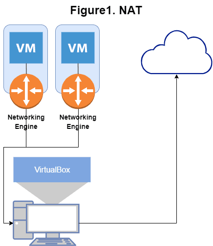
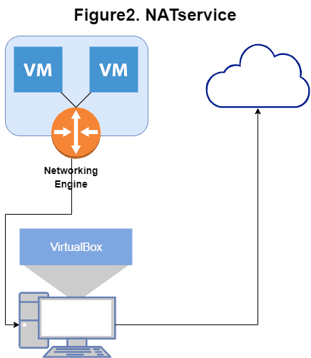
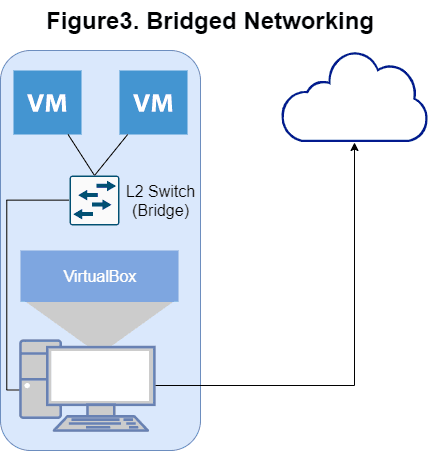
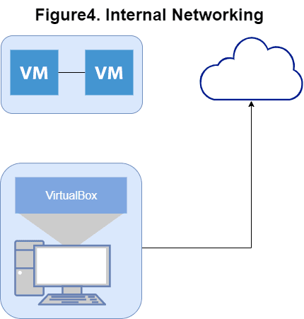
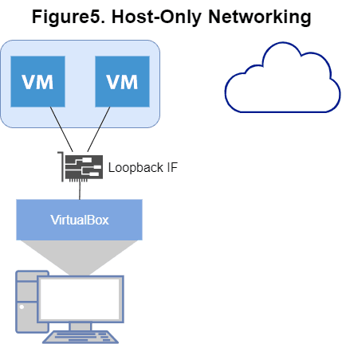

## 本記事作成のきっかけ

　以前読んだ『サーバ/インフラを支える技術』を読み直しており, その中で持った疑問を手を動かしながら解消したいと思いました。  
第一章は冗長化なので, VM を複数立ててフェイルオーバなどをシミュレートしたいと考えたのですが, VirtualBox で作成した VM 間の通信などを実現するにはどうするのが良いか, ちゃんと理解していなかったので調べようと思ったのが本記事のきっかけです。

今回の目的は「Web サーバのフェイルオーバのシミュレーション」なので, VM 間通信ができること, VM の外からの通信を受け付けられること[^1], の 2点の達成が必要です。

このためにまずは, VM の NW を決定する主要因である, **VirtualBox のそれぞれの NW アダプタモードで何ができるのか** を, VirtualBox のマニュアルを[^2]改めて読んで整理しました。

なお, 本記事では基本的な NW の説明は省略しているので, 理解できない点がある場合は『マスタリング TCP/IP 入門編』[^3]や, 『ネットワークはなぜつながるのか』を読まれることをお勧めします。

なお, 本記事執筆時に利用している VirtualBox のバージョンは 6.0.14 です。

## VM の NW 設定とは

　ここで取り上げている「VM の NW 設定」は, 「VM の NW をどのような方法で実現するか」ということです。  
物理マシンで「ホスト A, B を別々のルータに接続して NW セグメントを分けるか, それとも同じルータ (またはルータとつながったスイッチングハブ) とつなげて同じ NW セグメントに属させるか」などを考えるようなものです。

## なぜ NW アダプタモードの理解が必要か

　VirtualBox で VM の NW 設定のプリセットとして用意されているのが, 後述する 7種の NW アダプタモードです。例えば, VirtualBox ではデフォルトの NW アダプタモードとして NAT モードが選択されるのですが, この NAT モードのみを採用した VM では以下が不可能となります[^4]。

- ホスト -> ゲストの通信ができない (すなわち ssh もできない)
- ゲスト間通信もできない = サーバ同士の協調のシミュレーションができない
- インターネット -> ゲストの通信ができない = Web サーバの正確なシミュレーションができない

Web を調べると, NAT そのままでは利用できないこれらを実現する方法として NW アダプタモードの Bridge モードを利用する, という選択肢が見られるのですが, なぜそれでよいのか, 具体的にはどういう仕組みなのか, といった理屈をちゃんと分かっていないと個人的には不安です。  
実際, 設定によっては Bridge モードはマシンを丸ごと外にさらしてしまう可能性があり, 理解せず無批判に使うとセキュリティ上の問題も起こり得ます。  
例えば, ゲスト VM を Web サーバとして公開した場合, きちんとファイアウォールなどで必要最低限のポート開放などを設定しておかないと, 攻撃されるリスクも高まり, またこれを踏み台にしてホストマシンも攻撃にさらされる可能性もありそうです。

こうしたリスクを回避するためにも, どのように VM の NW が実現されているかを把握することが必要です。

## VM の NW アダプタモード

　では VirtualBox の NW アダプタモードについて, 以下から解説していきます。

VirtualBox では大別して 7種の NW アダプタモードを選べますが, ここでは主に利用される 5種を取り上げます。  
マニュアルにもある通り, モードの名称と各モードで実現できる機能は以下の通りです[^5]。

**Table 1. Overview of Networking Modes**

| Mode | VM `->` Host | VM `<-` Host | VM1 `<->` VM2 | VM `->` Net/LAN | VM `<-` Net/LAN |
| --- | --- | --- | --- | --- | --- |
| NAT | + | Port forward | - | + | Port forward |
| NATservice | + | Port forward | + | + | Port forward |
| Bridged | + | + | + | + | + |
| Internal | - | - | + | - | - |
| Host-only | + | + | + | - | - |

なお, 物理マシンに複数 NIC を差せるように, VirtualBox の VM も 8つまでの NIF (Network Interface) を持てます[^6]。  
すなわち, 上記 NW モードは組み合わせることが可能であり, 組み合わせも含めて今回の目的に適う NW モードを考えるのが本記事の焦点になります。

### 1. NAT (Network Address Translation) モード

　初めに紹介するのは NAT モードです。  
すでに書いたようにこれは VirtualBox のデフォルトのモードで, VM -> インターネット通信[^7]を実現するセキュアで簡単な方法です。

マニュアルによれば, NAT モードではホストと個々の VM 間にルータのような役割を果たす VirtualBox networking engine が存在し, これにより個々の VM が属するネットワークは区切られています。  
それぞれの VM がそれぞれのプライベート NW に属するので VM 間通信はできず, また同じ理由でホストから VM への通信もできません。



なお, VM が送ったパケットは最終的にホスト上の VirtualBox networking engine が再送することになるので, ホスト上の他のアプリや, 他のマシンから見ると, VM が送ったパケットはホスト OS の VirtualBox アプリが送ったように見えます。  
つまり, 送信元 IP がホストマシンのもので, 送信元ポート番号が VirtualBox のポートになる, ということですね。

#### NAT モードでの VM -> インターネット通信時のプロセスの様子

実際にこの様子を, NAT モードを適用した VM で firefox を利用し, 確認してみます。

`1. VM から firefox で www.google.com をリクエストし, TCP コネクションを生成`

```bash
firefox https://www.google.com
```

`2. www.google.com を名前解決してリクエスト先 IP アドレスを確認`

```text
kangetsu@web1:~$ dig www.google.com
; <<>> DiG 9.11.3-1ubuntu1.11-Ubuntu <<>> www.google.com
;; global options: +cmd
;; Got answer:
;; ->>HEADER<<- opcode: QUERY, status: NOERROR, id: 21087
;; flags: qr rd ra; QUERY: 1, ANSWER: 1, AUTHORITY: 0, ADDITIONAL: 1
;; OPT PSEUDOSECTION:
; EDNS: version: 0, flags:; udp: 65494
;; QUESTION SECTION:
;www.google.com. IN A
;; ANSWER SECTION:
www.google.com. 203 IN A 172.217.161.68
;; Query time: 4 msec
;; SERVER: 127.0.0.53#53(127.0.0.53)
;; WHEN: Tue Dec 31 01:51:00 UTC 2019
;; MSG SIZE rcvd: 59
kangetsu@web1:~$
```

`3. ホストマシンで TCP コネクションを確認し, PID を特定`[^8]

```text
C:\Users\USER>netstat -naop tcp | findstr 172.217.161.68
TCP 192.168.1.6:51555 172.217.161.68:443 TIME_WAIT 0
TCP 192.168.1.6:51568 172.217.161.68:443 ESTABLISHED 21556
C:\Users\USER>
```

`4. PID からプロセス名を特定`

```text
C:\Users\USER>tasklist /FI "PID eq 21556"
イメージ名 PID セッション名 セッション# メモリ使用量
========================= ======== ================ =========== ============
VBoxHeadless.exe 21556 Console 1 50,200 K
C:\Users\USER>
```

確かに, ホストマシン = **VM の外** から見ると, NAT モードでの TCP コネクションは VM そのものが生成しているものとしてではなく, **ホストマシンの VirtualBox アプリケーションが生成しているもの** として観測できました。

#### NAT モードで外から VM への通信を実現するポートフォワーディング

　少し本筋を逸れましたが, 以上述べた通り, NAT モードでは VM 発の通信はできますが, ホストも含め外から VM へ通信することはできません。  
つまり, VM 間通信もできないため本来の目的である「フェイルオーバの実験」はできそうにありません。

しかし, VirtualBox NAT モードでは物理ルータのようにポートフォワーディング[^9]の設定ができるため, これを使えば外からの通信を受け付けることが可能となります。  
ただ, ポートフォワーディングは VM ごとに, かつポート (≒ アプリ) ごとにフォワードするポートを変える必要があるので, VM やアプリの数が増えると面倒な点もあり, 今回はこの方法を使わないことにします。

ポートフォワーディングとこれを用いた VM への通信方法については[以前の記事](/2019/03/ctf-ssh-port-forwarding/)で紹介しているので, 詳しくはこちらをご参照ください。

### 2. NAT Service (NAT ネットワーク)

　次の NAT Service (NAT ネットワーク) モードは, 家庭用ルータと類似した機能です。
NAT モードでは個々の VM は個々の NW に属していましたが, NAT Service モードでは同じ NAT ネットワークを用いる VM を同一 NW にまとめるため, VM 間の通信は可能になります。  
ただし, 外からの通信は不可能です。  
確かに家庭用のルータと同じようなかたちですね。



NAT モードと同じく, ポートフォワーディングを使えば外からの通信を受け付けることはできます。  
それぞれの VM が同一 NW に属し, VM 間通信をできるようになるということでだんだんやりたいことに近づいてきています。  
ただ個人的には VM へ ssh して操作したいので, ssh のために個々の VM のポートフォワードを設定するのは避けたいところです。

### 3. Bridged Networking (ブリッジアダプター)

　冒頭でも挙げた Bridged モードは, ホストの物理 NIC を直接利用するようなモードです。
このとき, VM はホストにケーブルで物理的に接続されているような状態になる, とマニュアルにはあります。

モードの名前にもなっているブリッジは OSI 参照モデルの L2 (この場合 Ethernet) の拡張を行うもので, 複数の NW セグメントを同一セグメントにするものです。  
ここでのブリッジが VirtualBox にあたり, これによって VM の NW とホストが属する NW を同一セグメントであるかのように振る舞わせることができます。

物理デバイスで考えると, ホストに当たるマシンと, 複数の VM を同じスイッチングハブにつなぎ, そのスイッチングハブをルータにつなぐことで, 同じ NW セグメントとしている, というような感じかと思います。



ただしこの場合, ホストと VM が同じ NW に属することになるため, 極端な例ですが VM を Web サーバとして公開しようとして, VM がある NW = ホストもいる NW をインターネットに公開してしまった場合, ホストマシンも同様に外からアクセス可能な NW に存在することとなってしまいます。  
基本的には外からのリクエストを受け付ける役割を持つサーバ以外は公開されたネットワークに置かない方が良いため, Bridged モードを使って Web サーバを公開するのは避けた方が良いのではないのでしょうか。

ホストを公開 NW に置く積極的な理由が自分には思いつかないのですが, Bridged モードを使って VM を公開したい場合も, ルータやマシンのファイアウォールなどの設定を厳しく行うことが必須かと思います。

### 4. Internal Networking (内部ネットワーク)

　おそらく一番わかりやすいモードではないでしょうか。  
VM だけに閉じた内部 NW を形成するモードで, 同一 Internal NW を利用している VM 同士は通信でき, それ以外は不可能となります。



ホストから通信ができないのは面倒なので, 今回は不採用です。

### 5. Host-Only Networking (ホストオンリーアダプタ―)

　最後は Host-Only Networking (ホストオンリーアダプター) モードです。  
これは Bridged と Internal NW のハイブリッドと, マニュアルでは表現しています。

すなわち, Bridged モードのように, L2 スイッチでつながっているかのように VM 間やホストとの通信が可能であり, また Internal NW モードのようにホスト以外の外との通信はできない, というものです。

これは, VirtualBox が Software Network Interface (loopback IF) をホスト上に作成することで実現しています。  
Bridged とは異なり, 物理的な NWIF を利用しているわけではないので, ホストとの通信のみが可能で, インターネットなど外への通信はできません。



静的 IP アドレスの設定は必要ですが, ポートフォワーディング不要でホスト - VM 間通信が実現できるので, これは今回利用する価値がありそうです。

## 6. 結論

　以上を踏まえ, 今回の目的である「フェイルオーバのシミュレーション」を実現するために, 以下の設定を採用しようと思います。

- NIF1: NATservice
- NIF2: NATservice (冗長化検証用)
- NIF3: Host-only (ホストからの通信用)

Bridged はセキュリティの関係上今回採用しません。  
Internal NW はホストとも通信できず操作が面倒なので採用しません。  
今回は複数 VM を協調させることが必要なので, NAT ではなく NATservice で複数 VM を同一 NW にまとめてしまいます。  
NATservice だけだとホストからの通信を行うにはポートフォワーディングの設定が必要ですが, サーバ間通信のシミュレーションでも静的 IP アドレスがあった方がなにかと便利そうなので, ホストからの通信は静的 IP アドレスを設定[^10]して Host-Only NW で実現します。

以上となります。  
以前 NW を勉強しており, その上で改めてそれぞれの NW モードのマニュアルを読んだおかげで以前よりも理解ができたと思います。  
理解していればそれほど迷わず, モードの組み合わせも含めて目的を達成するための設定ができそうです。

実際にこの設定が思った通りに機能するかはこれからの確認になるので, 何か誤りがあれば都度修正しようと思います。

[^1]: Web サーバのシミュレーションなら理想的にはインターネットからの通信を可能にしたいですが, フェイルオーバが焦点なので今回はホストからの通信でも十分と考えました
[^2]: https://www.virtualbox.org/manual/ch06.html
[^3]: 最近新版が出ましたね, 私は最近読んだばかりなので嬉しいけど悲しい
[^4]: 一部はポートフォワーディングで可能となります
[^5]: Table 1 は VirtualBox のマニュアル https://www.virtualbox.org/manual/ch06.html に掲載されている表を一部改変しています
[^6]: 5つ以上は GUI からはできずコマンドラインツールの利用が必要
[^7]: これができないとカーネルやパッケージのダウンロード, update もできない
[^8]: 初回以降は名前解決結果のアドレスで findstr したときに結果が出ませんでしたが, firefox のキャッシュをクリアしたら出るようになったので, キャッシュサーバか何かとコネクションを張っていたようです
[^9]: ホストを宛先 IP, ポートフォワーディングで設定したポートを宛先ポートとしたパケットが届くと, それをリッスンしていた VirtualBox がそのパケットを VM の指定したポートに転送する
[^10]: 詳細な手順は省きますが, VirtualBox でホストオンリーネットワークを作成, VM の NW デバイスにアドレスを設定, で可能です
