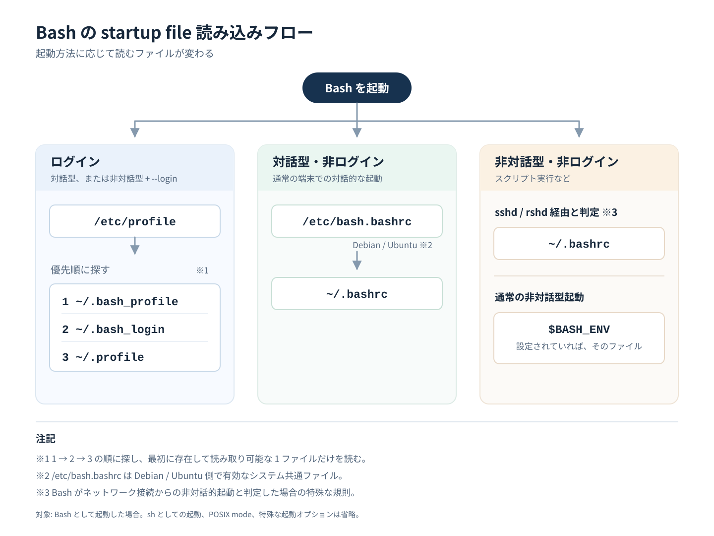

bash の起動時にあらかじめパスを通す、プロンプトをカスタマイズする、ツールの初期設定に相当するコマンドを実行する、などを実現するため、`.bashrc` などを編集することがあります。たとえば、mise ではログイン時に自動で mise を有効化するために、次の手順が記載されています[^1]。

```bash
echo 'eval "$(~/.local/bin/mise activate bash)"' >> ~/.bashrc
```

しかし、このような「シェルログイン時に自動でコマンドを実行」するためのファイルは、`.bashrc` 以外にも複数存在します。また、それぞれ実行条件があるため、常にそれら全てのファイルが実行されるわけではありません。実行順序によっては、あるファイルに書いたコマンドが、意図せず別のファイルのコマンドで結果を上書きされることもあるでしょう。

自分も整理ができていなかったため、この記事ではこれらのファイルの実行条件や実行順序を整理します。なお、ここでは bash を前提として bash 関連のファイルについてのみ記載しています。zsh など異なるシェルについては、そのシェルの man を確認してください。

[^1]: https://mise.jdx.dev/getting-started.html#activate-mise

## man の記載を見る

bash の man には [INVOCATION (起動) というセクション](https://man7.org/linux/man-pages/man1/bash.1.html#INVOCATION)があり、ここに記載されています。
いつ、どのファイルが、どの順序で実行されるかを判断するには、まずシェルの種類の整理が必要です。ここでは、「ログインシェル」と「インタラクティブシェル」の 2種が登場します。なお、重要なので先に書いておくと、これらは排他ではありません。ログイン/非ログイン、インタラクティブ/非インタラクティブの組み合わせで計 4種類のシェルがあり得ます。

## シェルの種類

### ログインシェル

ログインシェルは、「引数 0 の先頭文字が `-` か、`--login` オプション付きで起動されたシェル」とあります。

```text
INVOCATION
       A login shell is one whose first character of argument zero is a -, or one started with the --login option.
```

この説明だけではピンとこないので、ログインシェルから見ていきましょう。

Bash をスクリプトファイルや `-c` なしで起動した場合、起動時に渡された argument zero は `$0` から確認できます。
私は Linux VM を作成してそこに ssh して使用しているので、ssh 後に echo `$0` してみましょう。

```text
kangetsu@ubuntu24:~$ echo $0
-bash
kangetsu@ubuntu24:~$
```

確かに、`-bash` となっており、`-` つきの bash になっていました。`ps` コマンドでも見てみます。

```text
kangetsu@ubuntu24:~$ ps auxf
USER         PID %CPU %MEM    VSZ   RSS TTY      STAT START   TIME COMMAND
[...]
root      413194  0.0  0.0  12112  7424 ?        Ss   Sep20   0:00 sshd: /usr/sbin/sshd -D [listener] 0 of 10-100 startups
root      515407  0.0  0.0  16228  9000 ?        Ss   10:21   0:00  \_ sshd: kangetsu [priv]
kangetsu  515506  0.0  0.0  16452  6544 ?        S    10:21   0:01      \_ sshd: kangetsu@pts/1
kangetsu  515507  0.0  0.0   9004  5208 pts/1    Ss   10:21   0:00          \_ -bash
kangetsu  519113  100  0.0  11280  4092 pts/1    R+   11:55   0:00              \_ ps auxf
```

こちらでも、`ps auxf` の親プロセスについて、初めに `-` がついて `-bash` となっていることがわかります。

さらに、この状態から `bash` を実行して、そこで `echo $0` と `ps auxf` を実行してみます。すると、`-bash` の子プロセスは `bash` となり、`-` なしのものになりました。

```text
kangetsu@ubuntu24:~$ bash
kangetsu@ubuntu24:~$ echo $0
bash
kangetsu@ubuntu24:~$ ps auxf
USER         PID %CPU %MEM    VSZ   RSS TTY      STAT START   TIME COMMAND
[...]
root      413194  0.0  0.0  12112  7424 ?        Ss   Sep20   0:00 sshd: /usr/sbin/sshd -D [listener] 0 of 10-100 startups
root      515407  0.0  0.0  16228  9000 ?        Ss   14:56   0:00  \_ sshd: kangetsu [priv]
kangetsu  515506  0.0  0.0  16452  6544 ?        S    14:56   0:01      \_ sshd: kangetsu@pts/1
kangetsu  515507  0.0  0.0   9004  5208 pts/1    Ss   14:56   0:00          \_ -bash
kangetsu  519773  1.3  0.0   8852  5052 pts/1    S    16:34   0:00              \_ bash
kangetsu  519785  100  0.0  11280  4132 pts/1    R+   16:34   0:00                  \_ ps auxf
[...]
kangetsu@ubuntu24:~$
```

ちなみに、`-bash` というコマンドは実行できません。

```text
kangetsu@ubuntu24:~$ -bash
Command '-bash' not found, did you mean:
  command 'rbash' from deb bash (5.2.21-2ubuntu1)
  command 'bash' from deb bash (5.2.21-2ubuntu1)
Try: sudo apt install <deb name>
kangetsu@ubuntu24:~$
```

なぜならば、`ps` の `COMMAND` に表示される値は通常、プロセスの `args` であり、実行ファイル名そのものではないためです。
`ps` の `c` オプションを使うことで、コマンド名で表示することができます。こちらには、`-bash` ではなく `bash` と表示されていることがわかります。

```text
OUTPUT MODIFIERS
       c      Show the true command name.  This is derived from the name of the executable file, rather than from the argv value.  Command arguments and any modifications to them  are
              thus  not  shown.   This  option  effectively  turns  the  args  format keyword into the comm format keyword; it is useful with the -f format option and with the various
              BSD-style format options, which all normally display the command arguments.  See the -f option, the format keyword args, and the format keyword comm.
```

```text
kangetsu@ubuntu24:~$ ps auxfc
USER         PID %CPU %MEM    VSZ   RSS TTY      STAT START   TIME COMMAND
[...]
root      413194  0.0  0.0  12112  7424 ?        Ss   Sep20   0:00 sshd
root      515407  0.0  0.0  16228  9000 ?        Ss   14:56   0:00  \_ sshd
kangetsu  515506  0.0  0.0  16452  6544 ?        S    14:56   0:05      \_ sshd
kangetsu  515507  0.0  0.0   9004  5220 pts/1    Ss   14:56   0:00          \_ bash
kangetsu  520039  300  0.0  11280  4128 pts/1    R+   16:43   0:00              \_ ps
```

### インタラクティブシェル

インタラクティブシェルは、「非オプション引数なし (`-s` を指定した場合を除く)、かつ `-c` オプションなしで起動され、標準入力と標準エラー出力の両方がターミナルに接続されているシェル。または、`-i` オプション付きで起動されたシェル」とあります。普段使うシェルは、通常インタラクティブシェルでしょう。

```text
INVOCATION
[...]
       An interactive shell is one started without non-option arguments (unless -s is specified) and without the -c option, whose standard input and error are both connected to termi‐
       nals (as determined by isatty(3)), or one started with the -i option.  PS1 is set and $- includes i if bash is interactive, allowing a shell script or a startup  file  to  test
       this state.
```

ちなみに `-s`、`-c` オプションは、それぞれ次の意味を持ちます。

```text
OPTIONS
[...]
       -c        If the -c option is present, then commands are read from the first non-option argument command_string.  If there are arguments  after  the
                 command_string,  the  first argument is assigned to $0 and any remaining arguments are assigned to the positional parameters.  The assign‐
                 ment to $0 sets the name of the shell, which is used in warning and error messages.
[...]
       -s        If the -s option is present, or if no arguments remain after option processing, then commands are read from the standard input.  This  op‐
                 tion allows the positional parameters to be set when invoking an interactive shell or when reading input through a pipe.
```

- `-s`: 標準入力からコマンドを読み込む。インタラクティブシェル起動時やパイプ利用時に位置引数を渡せる

以下の例では、パイプ利用時に `bash` ではなく、標準入力として `bash` に実行を命じたコマンドに位置引数を渡しています。

```text
kangetsu@ubuntu24:~$ echo 'echo "$1 $2"' | bash -s hello world
hello world
kangetsu@ubuntu24:~$
```

`-s` を付けない場合、最初の非オプション引数 hello は位置引数ではなく、実行するシェルスクリプトのファイル名として解釈されます。そのため bash は hello というファイルを開こうとしてエラーになります。

```text
kangetsu@ubuntu24:~$ echo 'echo "$1 $2"' | bash hello world
bash: hello: No such file or directory
kangetsu@ubuntu24:~$
```

- `-c`: 引数で渡した文字列をコマンドとして実行する

次のように、文字列をコマンドとして解釈して実行します。コンテナで実行するコマンドとしてよく見ることがあります。

```text
kangetsu@ubuntu24:~$ bash -c 'echo hello'
hello
kangetsu@ubuntu24:~$
```

`-c` なしだと `echo hello` というファイルを実行しようとしてエラーになっています。

```text
kangetsu@ubuntu24:~$ bash 'echo hello'
bash: echo hello: No such file or directory
kangetsu@ubuntu24:~$
```

## INVOCATION の順序

シェルの整理がついたところで、ようやく「どの条件・どの順序でどのファイルが実行されるか」を確認します。

### ログインシェルの場合

```text
       When bash is invoked as an interactive login shell, or as a non-interactive shell with the --login option, it first reads and executes commands from the file  /etc/profile,  if
       that  file exists.  After reading that file, it looks for ~/.bash_profile, ~/.bash_login, and ~/.profile, in that order, and reads and executes commands from the first one that
       exists and is readable.  The --noprofile option may be used when the shell is started to inhibit this behavior.
```

初めに `/etc/profile` を実行します。その後、`~/.bash_profile`、`~/.bash_login`、`~/.profile` の順にファイルを探し、**初めに見つかり、かつ読み取り可能なもの** を実行します。なお、`--noprofile` オプションをつけていた場合はこの振る舞いは抑制されます。

ちなみに、ログインシェルが exit した場合、`~/.bash_logout` を実行します。

```text
       When an interactive login shell exits, or a non-interactive login shell executes the exit builtin command, bash reads and executes commands from the
       file ~/.bash_logout, if it exists.
```

1. `/etc/profile`
2. 以下の順序で探索して初めに見つかった読み取り可能ファイル
   1. `~/.bash_profile`
   2. `~/.bash_login`
   3. `~/.profile`

### 非ログインのインタラクティブシェルの場合

```text
       When an interactive shell that is not a login shell is started, bash reads and executes commands from /etc/bash.bashrc and ~/.bashrc, if these files
       exist.   This  may be inhibited by using the --norc option.  The --rcfile file option will force bash to read and execute commands from file instead
       of /etc/bash.bashrc and ~/.bashrc.
```

`/etc/bash.bashrc` と `~/.bashrc` を実行します。`--norc` オプションを渡していた場合、この振る舞いは抑制されます。

1. `/etc/bash.bashrc`
2. `~/.bashrc`

なお、`/etc/bash.bashrc` は Debian / Ubuntu 特有らしく、[Debian の README](https://sources.debian.org/src/bash/4.3-11/debian/README#L50-L56) に記載があります。

> 5. What is /etc/bash.bashrc? It doesn't seem to be documented.
> 
>    The Debian version of bash is compiled with a special option
>    (-DSYS_BASHRC) that makes bash read /etc/bash.bashrc before ~/.bashrc
>    for interactive non-login shells. So, on Debian systems,
>    /etc/bash.bashrc is to ~/.bashrc as /etc/profile is to
>    ~/.bash_profile.

### 通常の非インタラクティブシェルの場合

```text
       When bash is started non-interactively, to run a shell script, for example, it looks for the variable BASH_ENV in the environment, expands its value
       if it appears there, and uses the expanded value as the name of a file to read and execute.  Bash behaves as if the following command were executed:
              if [ -n "$BASH_ENV" ]; then . "$BASH_ENV"; fi
       but the value of the PATH variable is not used to search for the filename.
```

シェルスクリプトを実行する場合などのケースです。`BASH_ENV` 環境変数に設定されているファイルを実行します。このとき、`PATH` は `BASH_ENV` ファイルの探索に参照されません。

1. `BASH_ENV` 環境変数の値に設定されたファイル

### ssh 経由などネットワーク越しの実行かつ非インタラクティブの場合

```text
       Bash attempts to determine when it is being run with its standard input connected to a network connection, as when executed by the historical remote
       shell daemon, usually rshd, or the secure shell daemon sshd.  If bash determines it is being run non-interactively in this fashion, it reads and ex‐
       ecutes  commands  from /etc/bash.bashrc and ~/.bashrc, if these files exist and are readable.  It will not do this if invoked as sh.  The --norc op‐
       tion may be used to inhibit this behavior, and the --rcfile option may be used to force another file to be read, but neither rshd nor sshd generally
       invoke the shell with those options or allow them to be specified.
```

`/etc/bash.bashrc` と `~/.bashrc` を実行します。

1. `/etc/bash.bashrc`
2. `~/.bashrc`

### その他

この他、sh として実行した場合、`--posix` オプションを付与して実行した場合など、細かい条件がありますが、ここでは割愛します。気になる場合は man bash の INVOCATION セクションを改めて確認してみてください。

## まとめ

図にまとめると以下のようになります (これは Codex に描いてもらいました)。



## おまけ

man bash の FILES セクションにも簡単にこれらファイルの説明があります。

```text
FILES
       /bin/bash
              The bash executable
       /etc/profile
              The systemwide initialization file, executed for login shells
       /etc/bash.bashrc
              The systemwide per-interactive-shell startup file
       /etc/bash.bash.logout
              The systemwide login shell cleanup file, executed when a login shell exits
       ~/.bash_profile
              The personal initialization file, executed for login shells
       ~/.bashrc
              The individual per-interactive-shell startup file
       ~/.bash_logout
              The individual login shell cleanup file, executed when a login shell exits
       ~/.bash_history
              The default value of HISTFILE, the file in which bash saves the command history
       ~/.inputrc
              Individual readline initialization file
```

実はこの調べ物のきっかけは、VSCode で SSH した時に mise や aqua の activation スクリプトが実行されなかったことだったので、次回はこの記事の内容を前提にそれをまとめようと思います。
