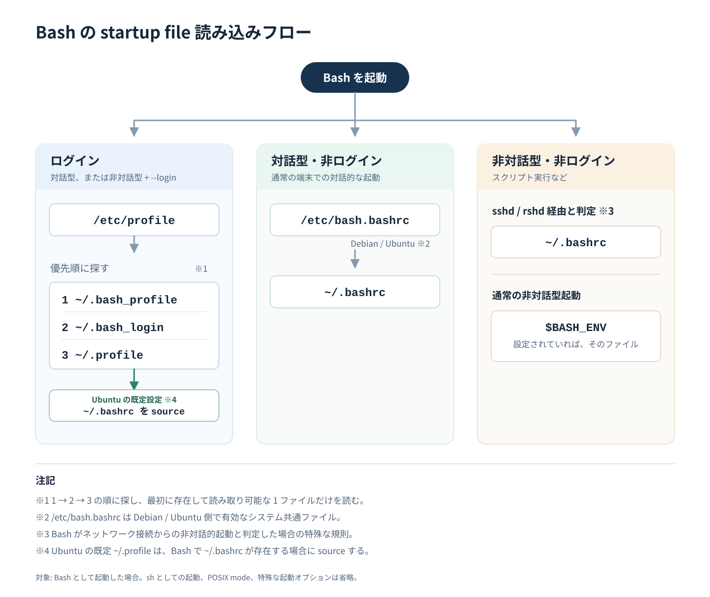

私は普段、multipass で作成した Ubuntu VM に [VS Code の Remote - SSH](https://code.visualstudio.com/docs/remote/ssh) を使って SSH して開発しています。エディタ、Git、ターミナルまで統合されており非常に便利です。

しかし先日、VS Code のターミナルで mise や aqua 経由でインストールしたコマンドが実行できないことがありました。あった気がするんです。しかし、今試すとそんなことはなくなっており、よくわからなくなりました。。

また、[前回の記事](/2026/09/bashrc-and-profile/)で、Bash 起動時に実行されるファイルの条件や順番についてまとめました。改めて調べる中で、もっとわかりやすい説明があったので、ここではそちらについて記載します。

## 何が起きた (と記憶している) か

go、mise などのインストールガイドには、以下のように `~/.bashrc` や `~/.profile` などに設定を追記するインストラクションがあります。

**go**:

[Download and install](https://go.dev/doc/install)

> 2. Add /usr/local/go/bin to the PATH environment variable.
>    
>    You can do this by adding the following line to your $HOME/.profile or /etc/profile (for a system-wide installation):
>    
>    ```bash
>    export PATH=$PATH:/usr/local/go/bin
>    ```
>    
>    Note: Changes made to a profile file may not apply until the next time you log into your computer. To apply the changes immediately, just run the shell commands directly or execute them from the profile using a command such as source $HOME/.profile.
> 
> 3. Add $HOME/go/bin (the default Go bin path) to your PATH environment variable to use tools installed via go install.
>    
>    You can do this by adding the following line to your $HOME/.profile or $HOME/.bashrc file:
>    
>    ```bash
>    export PATH="$PATH:$(go env GOPATH)/bin"
>    ```

**mise**:

[Getting started – 4. Activate mise](https://mise.jdx.dev/getting-started.html#activate-mise)

> `mise exec` works great for one-off commands, but for interactive shells you'll probably want to activate mise so tools and environment variables are loaded automatically.
> 
> There are two approaches:
> 
> - `mise activate` — updates your `PATH` and environment every time your prompt runs. Recommended for interactive shells.
> ...
> 
> ```bash
> echo 'eval "$(~/.local/bin/mise activate bash)"' >> ~/.bashrc
> ```

これらに従って `.bashrc` に設定を追記したのですが、ある時 VS Code で新たに立ち上げた bash で、mise でインストールした node や python が動かなかった記憶があります (今は再現しません)。
`bashrc`、`profile` などの bash 起動時に実行されるファイルの違いに由来するのかと考え、これをきっかけに前回の記事を書いたのですが、もはや調査は不要となりました。

しかし、再現確認をしようとしていた時に、前回の記事を補完するより良い説明があったので、そちらを代わりに記載します。

## bashrc や profile の実行条件・順序に迷ったら

ファイルをそのまま見るのが良いです。カスタマイズしていなければ、コメントなどにちゃんと書いてありました。
以下は、新たに追加した bash-test というユーザーの HOME ディレクトリにある `.bashrc` と `.profile` です。

### 初期からあるファイル一覧

初期状態では、`.bashrc` と `.profile` があります。

```text
bash-test@ubuntu24:~$ ls -la
total 24
drwxr-x--- 2 bash-test bash-test 4096 Sep 23 09:21 .
drwxr-xr-x 6 root      root      4096 Sep 23 09:20 ..
-rw------- 1 bash-test bash-test   21 Sep 23 09:21 .bash_history
-rw-r--r-- 1 bash-test bash-test  220 Sep 23 09:20 .bash_logout
-rw-r--r-- 1 bash-test bash-test 3771 Sep 23 09:20 .bashrc
-rw-r--r-- 1 bash-test bash-test  807 Sep 23 09:20 .profile
bash-test@ubuntu24:~$
```

### `~/.bashrc` 抜粋

```bash
bash-test@ubuntu24:~$ cat .bashrc
# ~/.bashrc: executed by bash(1) for non-login shells.
# see /usr/share/doc/bash/examples/startup-files (in the package bash-doc)
# for examples

# If not running interactively, don't do anything
case $- in
    *i*) ;;
      *) return;;
esac
# [...]
```

> ```bash
> # ~/.bashrc: executed by bash(1) for non-login shells.
> # [...]
> # If not running interactively, don't do anything
> ```

と書いてありますね。前回の記事の通り、**非ログインシェルかつインタラクティブシェルの場合** に実行されます。試してみましょう。

```text
kangetsu@ubuntu24:~/my-repo/my-blog$ tail -n 1 ~/.bashrc
echo "execute .bashrc"
kangetsu@ubuntu24:~/my-repo/my-blog$ 
```

この状態で bash を実行すると、`echo` が実行されます。

```text
kangetsu@ubuntu24:~/my-repo/my-blog$ bash
execute .bashrc
kangetsu@ubuntu24:~/my-repo/my-blog$ 
```

しかし、bash に別のスクリプトを実行させる = 非インタラクティブだと、`echo` は実行されません。

```text
kangetsu@ubuntu24:~/my-repo/my-blog$ bash README.md 
kangetsu@ubuntu24:~/my-repo/my-blog$ 
```

### `~/.profile`

```bash
# ~/.profile: executed by the command interpreter for login shells.
# This file is not read by bash(1), if ~/.bash_profile or ~/.bash_login
# exists.
# see /usr/share/doc/bash/examples/startup-files for examples.
# the files are located in the bash-doc package.

# the default umask is set in /etc/profile; for setting the umask
# for ssh logins, install and configure the libpam-umask package.
#umask 022

# if running bash
if [ -n "$BASH_VERSION" ]; then
    # include .bashrc if it exists
    if [ -f "$HOME/.bashrc" ]; then
        . "$HOME/.bashrc"
    fi
fi

# set PATH so it includes user's private bin if it exists
if [ -d "$HOME/bin" ] ; then
    PATH="$HOME/bin:$PATH"
fi

# set PATH so it includes user's private bin if it exists
if [ -d "$HOME/.local/bin" ] ; then
    PATH="$HOME/.local/bin:$PATH"
fi
```

> ```bash
> # ~/.profile: executed by the command interpreter for login shells.
> # This file is not read by bash(1), if ~/.bash_profile or ~/.bash_login
> # exists.
> ```

とあります。こちらも前回の記事のまとめと同じですね。ログインシェルの場合に実行されますが、`~/.bash_profile` と `~/.bash_login` が優先されます。

> ```bash
> # if running bash
> if [ -n "$BASH_VERSION" ]; then
>     # include .bashrc if it exists
>     if [ -f "$HOME/.bashrc" ]; then
>         . "$HOME/.bashrc"
>     fi
> fi
> ```

とあり、bash の場合は `~/.bashrc` が実行されます。bash そのものでは「ログインシェルの場合に `~/.bashrc` を実行する」という規定はありませんでしたが、少なくとも Ubuntu 24 では結果的に `~/.profile` が `~/.bashrc` を実行しているため、ログインシェルの場合で `~/.profile` が実行されたら `~/.bashrc` を実行する、ということになります。

この `.profile` は Ubuntu 規定の `/etc/skel/.profile` に由来しているため、私のカスタマイズではありません。

```text
kangetsu@ubuntu24:~/my-repo/my-blog$ sudo diff /etc/skel/.profile /home/bash-t
est/.profile
kangetsu@ubuntu24:~/my-repo/my-blog$ 
```

## まとめ

まとめます。前回の図に、 `~/.profile` -> `~/.bashrc` の追記をしたものを掲載します。



冒頭に書いた私の経験は、もしかしたら

- `~/.bashrc` に設定を記載
- `~/.bash_profile` を作成してあった

という条件が重なって起きたのかもしれません。ログインシェルかつ、`~/.bash_profile` の内部で `~/.bashrc` を読んでいなければ成立しますが、当時の状況は保存されていないので真相は闇の中です。
調べ物の良いきっかけにはなったのでよしとします。同じようなことに遭遇したら、これらファイルの実行条件・順序と、どこに何が書いてあるかを確認してみてください。
そうだったのかは定かではないのですが、今後は下手にドットファイルを増やさず、素直に公式ドキュメントに従うことにします。
